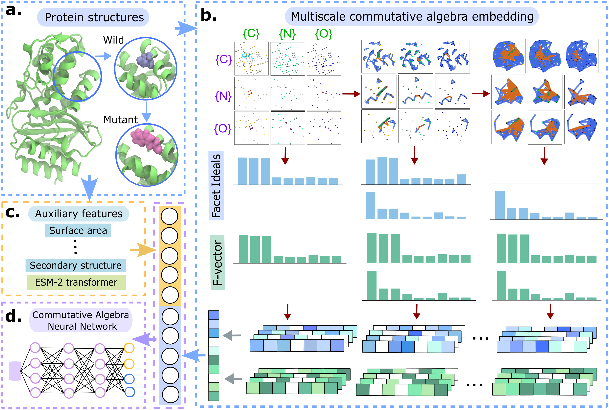

# CANet <!-- [](https://www.google.com/) --> [](https://opensource.org/licenses/MIT) 

**Commutative algebra neural network reveals genetic origins of diseases**

**Authors**: JunJie Wee, Faisal Suwayyid, Mushal Zia, Hongsong Feng, Yuta Hozumi, Guo-Wei Wei

---

## Introduction

This repository contains the source code for the **Commutative algebra neural network reveals genetic origins of diseases**, a unified deep learning framework for **disease-associated mutations, mutation-induced protein stability changes and protein solubility changes**.

**Keywords**: 

---

## Table of Contents

- [CANet](#CANet)
  - [Introduction](#introduction)
  - [Table of Contents](#table-of-contents)
  - [Model Framework](#model-framework)
  - [Getting Started](#installation)
    - [1. Prerequisites](#1-prerequisites)
    - [2. Clone the repository](#2-clone-the-repository)
    - [3. Folder Structure](#3-folder-structure)
  - [Datasets](#datasets)
  - [Feature generation](#feature-generation)
    - [1. Multiscale Commutative Algebra Embedding](#1-multiscale-commutative-algebra-embedding)
    - [2. Auxiliary Features](#2-auxiliary-features)
      - [BLAST+ and generate PSSM](#1-blast+-and-generate-pssm)
      - [MIBPB calculation](#2-mibpb-calculation)
      - [ESM-2 Transformer Features](#3-esm-2-transformer-features)
  - [Feature Preprocessing](#feature-preprocessing)
  - [Model Usage](#model-usage)
  - [License](#license)
  - [Citation](#citation)


---

## Model Framework

<!--  -->


---
## Getting Started

### 1. Prerequisites

- fair-esm                  2.0.0
- numpy                     1.23.5
- scipy                     1.11.3
- torch                     2.1.1
- pytorch-cuda              11.7
- scikit-learn              1.3.2
- python                    3.10.12

### 2. Clone the repository

```bash
git clone https://github.com/ExpectozJJ/CANet.git
cd CANet
```

### 3. Folder Structure
```
│   README.md
└─────────────────────────────────────────────────────mutsol
└─────────────────────────────────M546                |   test_v2.txt                     
└───S2648                         │                   │   train_v2.txt
    │   S2648.txt                 │   M546.txt        │   mutsol.txt
    │   S350.txt                  └───blast_jobs      └───blast_jobs
    └───blast_jobs                └───blast_out       └───blast_out
    |   │   1A5E_A_L_37_S.job     ...                 ...
    |   |   ...                   └───SR_out          └───SR_out
    └───blast_out                                     └───pdb                                       
    │   1A5E_A_L_37_S.out                                 │   117391.pdb
    |   |   ...                                           |   ... 
    └───feat_jobs
    │   1A5E_A_L_37_S.job
    |   |   ...
    └───feat_out
    │   1A5E_A_L_37_S.out
    |   |   ...
    └───seq_jobs
    │   1A5E_A_L_37_S.job
    |   |   ...
    └───seq_out
    │   1A5E_A_L_37_S.out
    |   |   ...
    └───SR_jobs
    │   1A5E_A_L_37_S.job
    |   |   ...
    └───SR_out
    │   1A5E_A_L_37_S.out
    |   |   ...
    └───features
        └───1A5E_A_L_37_S
        └───1A5E_A_L_121_R
        └───1A5E_A_W_15_D
        ...
        └───451C_A_W_77_F
```

## 4. Package Installation
This setups the package to generate features for CANet
At `bin`, change the directory of `jackal.dir` to your local path.
```shell
cd code
python setup.py build_ext -i
cd ..
cd S2648/features/1A5E_A_L_37_S
ln -s ../../bin/jackal.dir jackal.dir
ln -s ../../bin/profix profix
ln -s ../../bin/scap scap
ln -s ../../code/structure.py structure.py
ln -s ../../code/protein.py protein.py
ln -s ../../code/src src
```
You may also use 
```shell
pip install -e . -v
```
to install the package.

### Run 
```shell
python structure.py 1A5E A A L 37 S 
python protein.py 1A5E A A L 37 S 
```

## Datasets 

| Disease-association       | No. of samples | Task   |
|-----------------|----------------|--------|
| M546            | 492            | 10-fold cross-validation       |
| M546            | 54             | Blind test   |

| Protein stability changes       | No. of samples | Task   |
|-----------------|----------------|--------|
| S2648           | 2648           | 5-fold cross-validation   |
| S350            | 350            | Blind test  |

| Protein solubility changes       | No. of samples | Task   |
|-----------------|----------------|--------|
| PON-Sol2        | 6238           | 10-fold cross-validation   |
| PON-Sol2        | 662            | Blind test   |
---

---
## Feature generation
### Multiscale Commutative Algebra Embedding
```shell
# 
python feature_SR.py <PDB ID> <Protein Chains> <Mutation chain> <Wild Residue> <Residue ID> <Mutant Residue> <pH>

# examples
module purge
module load GCC/12.3.0 OpenMPI/4.1.5-GCC-12.3.0
python feature_SR.py 1AFO A A A 65 P 7
```

### Auxiliary Features 
#### BLAST+ and generate PSSM
```shell
# Generate PSSM scoring matrix (Requires BLAST+ 2.14.1)
python prepare.py <PDB ID> <Protein chains> <Mutation chain> <Wild Residue> <Residue ID> <Mutant Residue> <pH>

# Add module load BLAST+/2.14.1-gompi-2023a into job script
# Run BLAST+ PSSM calculations
python prepare.py 1A4Y A A D 435 A 7.0 
```

```shell
conda install sbl::dssp (DSSP v4.2.2.1)
```

#### MIBPB calculation
```
# Requires pqr file
mibpb5 <PQR filename> h=0.7
```

#### ESM-2 Transformer Features 
 
```shell
# Generate transformer features
python feature_seq.py <PDB ID> <Protein chains> <Mutation chain> <Wild Residue> <Residue ID> <Mutant Residue> <pH>

# examples
python feature_seq.py 1AFO A A A 65 P 7.0
```

The blast_jobs, feat_jobs, seq_jobs and SR_jobs folder contains scripts used to run feature generation process in a step-by-step procedure with the help of a high performance computing resource.

---

## Feature Preprocessing

The scripts here will generate features for entire datasets. 

Disease-associated mutations
```shell
python Fit_M546.py
python build_M546.py
```

Mutation-induced protein stability changes
```shell
python Fit_S2648.py
python build_2648.py
```

Mutation-induced protein solubility changes
```shell
python Fit_mutsol.py
python build_mutsol.py
```

## Model Usage
```shell
usage: PPI_multitask_DMS_mega.py [-h] [--batch_size BATCH_SIZE] [--epochs EPOCHS] [--lr LR] [--momentum MOMENTUM]
                                 [--weight_decay WEIGHT_DECAY] [--no_cuda] [--seed SEED] [--log_interval LOG_INTERVAL]
                                 [--layers LAYERS] [--continue_train CONTINUE_TRAIN] [--prediction PREDICTION]
                                 [--pred PRED] [--cv CV] [--cv_type CV_TYPE] [--model MODEL]
                                 [--normalizer1_name NORMALIZER1_NAME] [--normalizer2_name NORMALIZER2_NAME]
                                 [--freeze FREEZE] [--skempi_pretrain SKEMPI_PRETRAIN] [--ft FT] [--finetune FINETUNE]
                                 [--debug DEBUG] [--DMS_data DMS_DATA] [--pred_DMS PRED_DMS]

options:
  -h, --help            show this help message and exit
  --batch_size BATCH_SIZE
                        input batch size for training (default: 50)
  --epochs EPOCHS       number of epochs to train (default: 500)
  --lr LR               learning rate (default: 0.001)
  --momentum MOMENTUM   SGD momentum (default: 0.9)
  --weight_decay WEIGHT_DECAY
                        SGD weight decay (default: 0)
  --no_cuda             disables CUDA training
  --seed SEED           random seed (default: 1)
  --log_interval LOG_INTERVAL
                        how many batches to wait before logging training status
  --layers LAYERS       neural network layers and neural numbers
  --continue_train CONTINUE_TRAIN
                        run training
  --prediction PREDICTION
                        prediction
  --pred PRED
  --cv CV               cv (launch validation test)
  --cv_type CV_TYPE     skempi2 or alphafold (select original PDB or AF3 validation)
  --model MODEL         prediction model
  --normalizer1_name NORMALIZER1_NAME
                        mega dataset
  --normalizer2_name NORMALIZER2_NAME
                        Lap and ESM dataset
  --freeze FREEZE       freeze weights and biases of hidden layers
  --skempi_pretrain SKEMPI_PRETRAIN
                        finetune DMS with SKEMPI2
  --ft FT               finetune pretrained model with DMS
  --finetune FINETUNE   finetune model with DMS data
  --debug DEBUG         debugging channel
  --DMS_data DMS_DATA   predict full DMS data
  --pred_DMS PRED_DMS   predict full DMS data
```

---

## License
This project is licensed under the MIT License - see the [LICENSE](LICENSE) file for details.
---

## Citation
If you use this code in your work, please cite our work. 
- 
---
